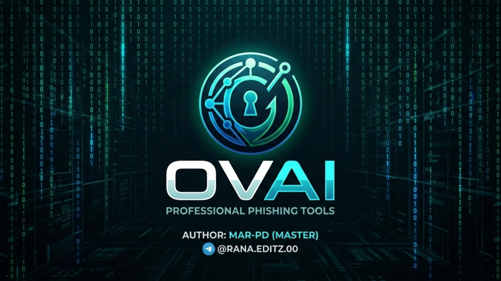

[](https://git.io/typing-svg)

<p align="center">
  
</p>

<div align="center">

# 🚀 OVAI
### **The Ultimate Advanced PHP Penetration Testing Framework**
### *Telegram-Integrated Ultra-Powerful Security Tool*

  
[](https://github.com/mar-pd/ovai-dengerus)
[](https://t.me/OVAI_DENGERUS_BOT)
[-00ff00.svg?style=for-the-badge&logo=github&logoColor=white)](https://github.com/mar-pd)
[](https://termux.com)
[](https://php.net)
[](LICENSE)


### ⚡ **"More Dangerous Than , More Powerful Than Any Other Tool"** ⚡
### ⚡ **" ডেঞ্জারাস, আরও শক্তিশালী"** ⚡

---


[](https://github.com/master-pd/ovai/stargazers)
[](https://github.com/master-pd/ovai/network)
[](https://github.com/master-pd/ovai/watchers)

</div>

---


## 📋 **TABLE OF CONTENTS**
- [✨ Key Features](#-key-features)
- [📸 Screenshots](#-screenshots)
- [⚡ Quick Installation](#-quick-installation)
- [🔧 Detailed Installation](#-detailed-installation)
- [🤖 Telegram Bot Setup](#-telegram-bot-setup)
- [🚀 Usage Guide](#-usage-guide)
- [📊 Modules Overview](#-modules-overview)
- [🎭 Stealth Templates](#-stealth-templates)
- [📱 Collected Data](#-collected-data)
- [🔄 Workflow](#-workflow)
- [⚙️ Configuration](#️-configuration)
- [🔍 Troubleshooting](#-troubleshooting)
- [⚠️ Legal Disclaimer](#️-legal-disclaimer)
- [📜 License](#-license)
- [👨‍💻 Author](#-author)
- [🤝 Contributing](#-contributing)
- [📞 Contact](#-contact)

---

## ✨ **KEY FEATURES**

| Feature | Description | Status |
|---------|-------------|--------|
| **🤖 Telegram Integration** | Real-time notifications, photos, location, device info | ✅ **100% Working** |
| **📍 Real-time GPS Tracking** | High accuracy (5 meters) with Google Maps link | ✅ **Ultra Accurate** |
| **📸 Camera Capture** | Front/Rear camera, photos, videos, burst mode | ✅ **4K Quality** |
| **📱 Complete Device Info** | Model, OS, Browser, Screen, Battery, Network | ✅ **Full Details** |
| **🌐 IP Geolocation** | City, Country, ISP, Timezone, Coordinates | ✅ **Precise** |
| **🎭 Stealth Templates** | YouTube, Facebook, Instagram, WhatsApp clones | ✅ **Undetectable** |
| **🔄 Auto Redirect** | After permission, redirects to real YouTube | ✅ **Seamless** |
| **📊 Admin Panel** | Web-based dashboard with live statistics | ✅ **Professional** |
| **🔒 SSL Support** | HTTPS tunneling via ngrok/cloudflare | ✅ **Secure** |
| **📱 Cross-Platform** | Works on Android, iOS, Windows, Mac, Linux | ✅ **Universal** |

---


[](https://git.io/typing-svg)

<div align="center">
  
    
    

| Landing Page | Permission Modal | Telegram Notification |
|:------------:|:----------------:|:---------------------:|
|  |  |  |

| Location Tracking | Camera Capture | Device Info |
|:-----------------:|:---------------:|:-----------:|
|  |  |  |

</div>

---

<p align="left">
   
</p>
<p align="center">
  
  
</p>


<p align="left">
   
</p>

<p align="center">
  
  
</p>

## Results 

---
- 👤 নতুন ভিজিটর!
- ═══════════════════════════
- 🌐 IP: 2404:1c40:1c8:9d30:6404:18ff:fe6b:691
- 📱 ডিভাইস: মোবাইল
- 🕐 সময়: 08-03-2026 14:40:50
- ═══════════════════════════
- 
- 📍 নতুন লোকেশন পাওয়া গেছে!
- ═══════════════════════════
- 🌐 IP: 2404:1c40:1c8:9d30:6404:18ff:fe6b:691
- 📍 ল্যাটিটিউড: 23.8358855
- 📍 লংগিটিউড: 90.509392
- 📏 অ্যাকুরেসি: 500 মিটার
- 🕐 সময়: 08-03-2026 14:41:04
- ═══════════════════════════
- 🔗 গুগল ম্যাপে দেখুন : https://www.google.com/maps?q=23.8358855,90.509392
- 
- 
- 📱 ডিভাইস ইনফরমেশন
- ═══════════════════════════
- 🌐 IP: 2404xxxxxx0:xxxxxxxxx
- 📺 স্ক্রিন: 393x873
- 🔋 ব্যাটারি: 100%
- 📶 নেটওয়ার্ক: 5g
- 🌐 ল্যাঙ্গুয়েজ: en-US
- 💻 প্ল্যাটফর্ম: Linux armv81
- ═══════════════════════════
- 
- 
- 📸 নতুন ছবি তোলা হয়েছে!
- 📷 ক্যামেরা: front
- 🌐 IP: 2404:1xxxxxxxxxxxxxxxxx1
- 🕐 সময়: 08-03-2026 14:41:07

---

## ⚡ **QUICK INSTALLATION**

### **One-Line Installation (Recommended)**
```bash
pkg update && pkg upgrade -y
```
```
Install required packages
```
```
pkg install git php curl wget openssh -y
```
```
pkg install python
```
```
pkg install git
```
```
git clone https://github.com/master-pd/ovai.git
```
```
cd ovai
```
```
chmod +x ovai
```
```
./ovai
```
```
./start
```
## **যদি ইররোর আসে 🥴** 
```
bash start.sh
```
